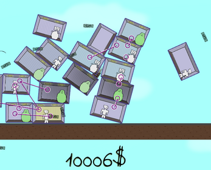
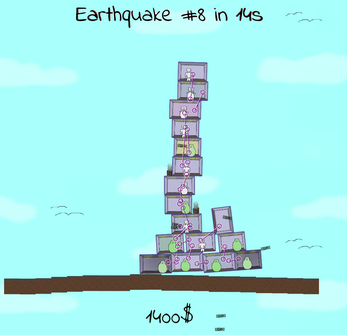
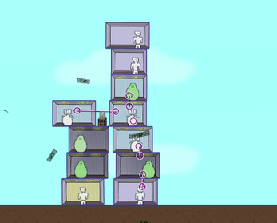

# Babbling Tower (they really do babble a lot.)

Haunted by recurring earthquakes, the Babblers want you to expand and secure their home tower. Earn enough money to realize their grand vision!

A game developed in Rust using the Bevy engine made for the fifth Bevy Game Jam.

Play it using this [link](https://soloantares.itch.io/babbling-towers)!

---
Survive the earthquakes!            |  Build high to earn more!        |  Secure your building with straps!
:-------------------------:|:-------------------------:| :-------------------------:
  |    | 

